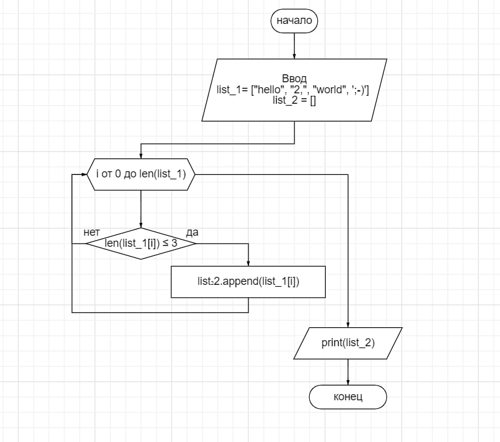

#Итоговая работа:

##1. Добавляю блок схему.

##2. Описание блок схемы.
1. Старт.
2. Задаем массивы.
3. Запускаем цикл for с переменной i от 0, до длинны списка list_1.
4. Проверяем соблюдение условия, меньше ли длинна элемента, чем 3.
* Если условие выполнено, то добовляем подходящий элемент в список list_2 и возращаемся к циклу.
* Если условие не выполненно, продолжаем цикл.
5. По завершению цикла for выводим заполненный список list_2
6. Завершаем программу.